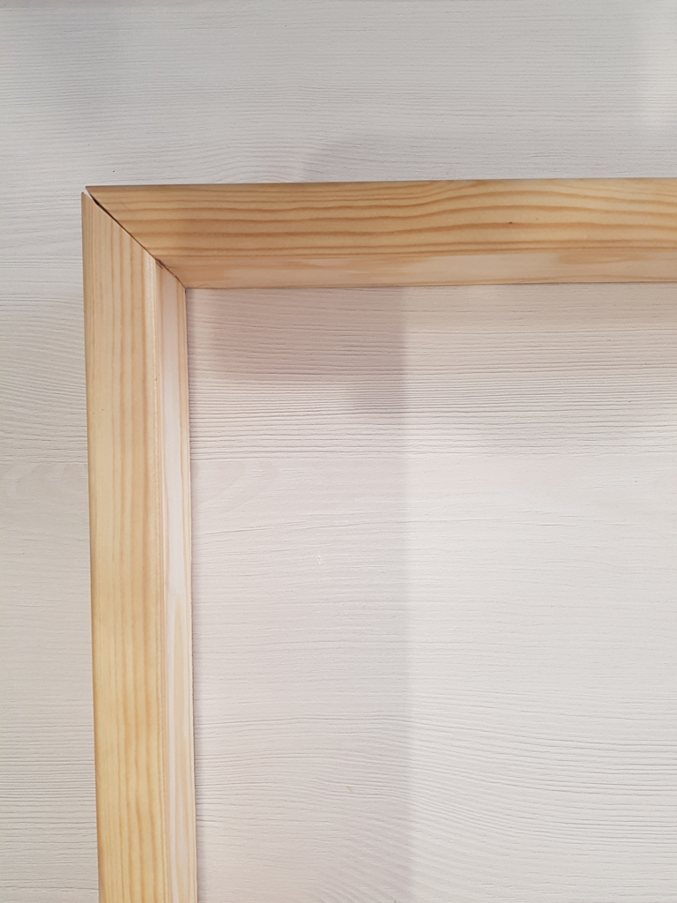

# LedStrip Matrix Project (25x21)
---

## Index
- Why am I doing this?
- Used stuff
- Process
- Workarounds & Hacks
- Fails
- Bibliography

## Why am I doing this? 
I want to create a dynamic retro pixelArt frame using RGB led strip and arduino.

## Used stuff
#### Construction Material
- Foam board
- Wood planks
- Wooden board (DM)
- Styroglass ice board (translucent)
- Black acrylic paint
- Tin
- Double-sided tape
- Screws

#### Electronic Material
- 525 x WS2812B LED's (I used 2 ledStrips of 5m and 60 led/m)
- 1 x 5V 30A Power Supply (26,25A needed)
  -  Led comsumption on white color and 100% brighness is 50mAh
- 1 x Arduino Mega (compatible also with UNO)
- 4 x 220 Ohms resistors
- 4 x Diode led
- 3 x Switches
- 3 x 10KOhms resistors
- 1 x 1000Uf 10V Capacitor (recomended)
- 1 x 470 Ohms resistor (recomended)
- Sockets and pins (recomended)
- Wires (it's cooler using differnt wire colors)

  
#### Tools
- Tin welder
- Screwer
- Brush
- Wood glue and/or staples
- Hot glue gun (recomended)
- Wire strippers (recomended)
- Multimeter (recomended)
- Protoboard (recomended)

## Process
#### The PoC
- In progress
  

#### The box
- In progress

#### The electronic circuit
- In progress

#### The program (arduino)
- In progress
#### Adding program Selector
- In progress
#### Adding brightness button selector
- In progress

#### Final result
- In progress

## Workarounds & Hacks
#### Serpent connect issue
- In progress
#### Mix of two different manufacturer ledStrips (different color interpretation)
- In progress

## Fails
#### Lack of electronic knowledge before start (burn stuff several times)
- In progress

## Bibliography
#### Idea basis
- https://www.instructables.com/id/Make-Your-Own-10x10-LED-Matrix/
- https://www.brainy-bits.com/arduino-16x16-matrix-frame/
#### How to add stuff
- https://www.instructables.com/id/How-to-use-a-Push-Button-Arduino-Tutorial/
#### Code Libraries & Examples
- https://github.com/FastLED/FastLED/tree/master/examples
- https://github.com/DisplayCore/NeoMatrix/tree/master/examples/HelloYoutube